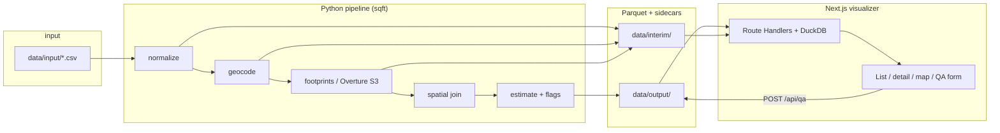
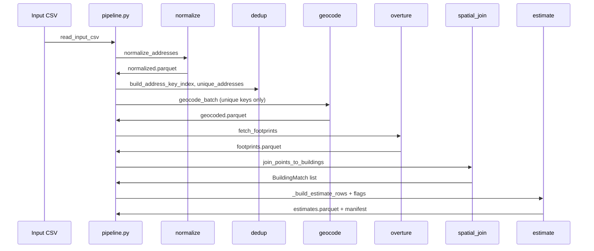
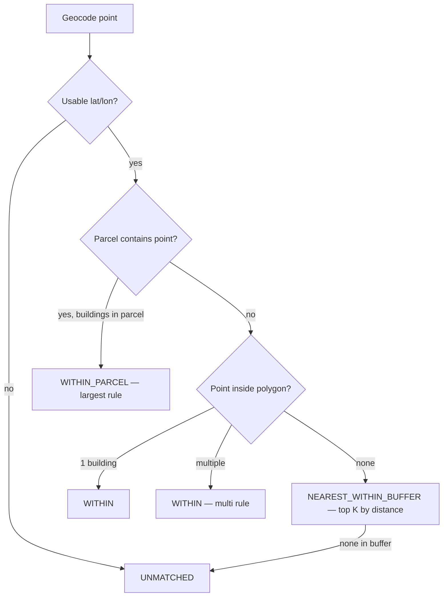

# FootprintIQ — Architecture

FootprintIQ estimates building square footage for large portfolios of US commercial addresses. The system has two cooperating parts:

1. **Python pipeline** (`backend/src/sqft/`) — batch processing: geocode, fetch Overture building footprints from AWS S3, spatial join, floor resolution, confidence flags, parquet outputs.
2. **Next.js visualizer** (`frontend/`) — human QA over the same parquet files via DuckDB in Route Handlers. There is no separate API service; the frontend reads what the pipeline wrote.

All user-facing operations go through **`make`** (see `Makefile` and `make help`). Configuration lives at the **repo root** (`config.yaml`, `.env`).

---

## System context



| Concern | Implementation |
|--------|----------------|
| Orchestration | `sqft.pipeline.run_pipeline` |
| CLI | `python -m sqft.cli` (Typer) |
| Contracts | `backend/src/sqft/schema.py` ↔ `frontend/lib/schema.ts` (sync test) |
| Geocoding | Google Places (chains) + Google Geocoding (non-chain), SQLite cache |
| Footprints | Overture Maps buildings theme on `overturemaps-us-west-2` S3 |
| Spatial math | Shapely + EPSG:5070 (CONUS Albers) for areas and distances |
| Viz data access | `@duckdb/node-api` in-memory, `read_parquet()` over resolved paths |

---

## Repository layout

```
footprintiq/
├── config.yaml              # Pipeline defaults (env SQFT_* overrides)
├── .env / .env.example      # Secrets + SQFT_DATA_DIR (repo root only)
├── Makefile                 # make demo | sample | full | viz | test-*
├── data/                    # Runtime (gitignored): input / interim / output
├── backend/src/sqft/        # Pipeline package
├── frontend/                # Next.js App Router visualizer
└── tests/fixtures/          # sample_addresses.csv + synthetic parquets
```

**Data directory** (default `data/`, override with `SQFT_DATA_DIR`):

| Path | Contents |
|------|----------|
| `data/input/` | Production CSV (e.g. `all.csv`, gitignored) |
| `data/interim/` | Resume checkpoints + geocode cache + Overture STAC index |
| `data/output/` | `estimates.parquet`, `qa_reviews.parquet`, `run_<id>/manifest.json`, reports |

---

## Pipeline stages

`run_pipeline()` in `pipeline.py` runs stages in order. Each stage writes a parquet checkpoint under `data/interim/` except the final estimate, which goes to `data/output/estimates.parquet`. A **run manifest** is written to `data/output/run_<pipeline_run_id>/manifest.json`.

### Stage flow



### 1. Input (`io.read_input_csv`)

Required CSV columns (validated by `RawAddress` in `schema.py`):

| Column | Type | Notes |
|--------|------|-------|
| `location_id` | string | Stable ID; prefixes like `WMART_` drive chain detection |
| `address_line_1` | string | Street line |
| `city` | string | |
| `state` | string | Two-letter USPS code |
| `postal_code` | string | Normalized to ZIP5 |
| `location_type` | enum | `retail`, `warehouse`, or `other` |

Optional `pipeline.sample_size` (CLI `--sample-size`) truncates rows after read.

### 2. Normalize (`normalize.py`)

For each `RawAddress`:

- Builds `address_input` (display/trace string).
- Lowercases and trims line, city, state; extracts ZIP5 from postal code.
- Computes **`address_key`**: `line|city|state|zip5` — the dedup and geocode cache key.
- Detects **`chain_token`** from `location_id` prefix (`WMART_` → walmart) or substring match against `config.yaml` `geocoder.chain_tokens`.

Output: `data/interim/normalized.parquet` (`NormalizedAddress`).

### 3. Dedup (`dedup.py`)

Not a separate parquet stage; runs in memory after normalize:

- **`unique_addresses`**: one `NormalizedAddress` per distinct `address_key` (first row wins).
- **`build_address_key_index`**: maps `address_key` → list of `location_id`s sharing that address.

Geocoding calls Google only for **unique** keys (~22K locations may collapse to fewer API calls). Spatial join later **fans out** one geocode result to every `location_id` sharing the key.

### 4. Geocode (`geocode.py`, `places.py`)

**Provider routing:**

| Condition | API | Provider enum |
|-----------|-----|----------------|
| `chain_token` set | Google Places Text Search + Place Details | `google_places` |
| Otherwise | Google Geocoding API | `google_geocoding` |
| Cache hit | No HTTP | `cache` |

**Behavior:**

- Async batch with semaphore (`concurrency`) and token-bucket rate limit (`rate_limit_qps`).
- Retries on 429/5xx with exponential backoff.
- Results stored in **`data/interim/geocode_cache.sqlite`** (WAL mode, keyed by `address_key`). Full provider JSON is hashed for audit (`raw_response_hash`).
- **`min_acceptable_precision`** (`RANGE_INTERPOLATED` by default): sub-threshold results are logged but coordinates are still kept when present (`status` may be `ok` or `low_precision`) so Overture and spatial join can run.
- **`has_usable_coordinates`**: `lat`/`lon` present and `status` in `ok` | `low_precision`.

Output: `data/interim/geocoded.parquet` — **one row per `address_key`**, not per `location_id`.

**Cost estimation** (`estimate_cost_usd`): Places ≈ $32/1k (2 calls per chain miss), Geocoding ≈ $5/1k.

### 5. Footprints — Overture (`overture.py`)

Fetches building polygons for all geocoded points with usable coordinates.

**Release resolution** (`resolve_release`):

- `config.overture.release: latest` → scrapes Overture release calendar (fallback `2026-05-20.0`).
- Pinned release string skips HTTP lookup.

**STAC / file index** (`_fetch_stac_building_files`):

Before querying buildings, the pipeline needs a list of S3 parquet files with geographic extents:

1. Try Overture STAC collection HTTP (`stac.overturemaps.org`) — parallel item fetch, cached to `data/interim/overture_stac_buildings_<release>.json`.
2. On failure: **DuckDB S3 glob** over `s3://overturemaps-us-west-2/release/{release}/theme=buildings/type=building/*.parquet`, computing min/max bbox per file (slow one-time; same cache path).

`make stac-cache` pre-builds this index so `make sample` does not fail mid-run.

**Query strategy** (`query_bboxes`):

- If all usable points fit in a single bbox span ≤ 0.2° lon/lat → one aggregate bbox (±0.005° padding).
- Otherwise → **per-point bboxes** so nationwide samples do not scan the entire US theme.

For each bbox:

1. `parquet_paths_for_bbox` — STAC file bboxes intersecting query bbox.
2. DuckDB `read_parquet(?)` with bbox filter on Overture `bbox.*` columns.
3. Deduplicate by building `id` across queries.

Selected columns become `footprints.parquet` (`Footprint` schema): WKB geometry, bbox, height, num_floors, class/subtype, source metadata.

Output: `data/interim/footprints.parquet`.

### 6. Spatial join (`spatial_join.py`)

For each `(location_id, address_key)` pair, matches geocode point to footprints loaded from parquet (WKB → Shapely, EPSG:4326).

**Match order** (first hit wins):



| `MatchMethod` | Meaning |
|---------------|---------|
| `within` | Point inside exactly one (or chosen among several) footprint |
| `within_parcel` | Parcel polygon contains building centroid (v1: `NullParcelProvider` — never used) |
| `nearest_within_buffer` | Closest building within `search_buffer_meters` (default 25 m), up to `nearest_k` candidates |
| `unmatched` | No building or bad geocode |

**Multi-building rule** (`multi_building_rule: largest_within_parcel`): when multiple footprints qualify, pick **largest area** (EPSG:5070 via `area.polygon_area_sqft`).

**Location-type filter** (retail/warehouse): prefer Overture classes `commercial`, `industrial`, `retail` when any candidate matches; otherwise keep all.

**Distances**: point-to-polygon edge distance in EPSG:5070 meters; 0 if inside.

Output: in-memory `list[BuildingMatch]` with `candidates` (serialized later to `candidates_json` on `EstimateRow`).

### 7. Estimate + flags (`pipeline._build_estimate_rows`, `floors.py`, `flags.py`)

Per `BuildingMatch`:

1. Resolve chosen candidate area → `footprint_area_sqft`.
2. **`resolve_floors`**: prefer `num_floors`, then infer from `height` / subtype defaults (`config.floors.prefer`, caps, warehouse single-story subtypes).
3. **`estimated_sqft`** = `round(footprint_area_sqft × num_floors_used, decimals)` (default 0 decimals).
4. Copy Overture metadata from footprints parquet.
5. **`evaluate_flags`**: set boolean columns + `flags_json` from predicates in `flags.py`.
6. **`resolve_confidence`**: `high` / `medium` / `low` / `unmatched` from flag combination.

| Flag | Typical trigger |
|------|-----------------|
| `NO_BUILDING_MATCH` | No `building_id` |
| `LOW_GEOCODE_PRECISION` | Worse than rooftop / range-interpolated |
| `MULTI_BUILDING_PARCEL` | `multi_building_count > 1` |
| `OLD_FOOTPRINT` | Overture `update_time` year &lt; 2018 |
| `NEAREST_FALLBACK` | Nearest-buffer match used |
| `AREA_OUT_OF_RANGE` | Area &lt; 500 or &gt; 5M sqft |
| `HEIGHT_OUTLIER` | Height &gt; 200 m |
| `MISSING_FLOORS_TALL_BUILDING` | Tall height, no `num_floors` |
| `GEOCODE_FAILED` | Missing coordinates |
| `SUITE_OR_TENANT_ADDRESS` | Suite/unit tokens in input |

Output: `data/output/estimates.parquet` (`EstimateRow`).

### 8. Manifest (`manifest.py`)

`RunManifest` records:

- `pipeline_run_id` (`YYYYMMDDTHHMMSSZ__<uuid8>`)
- Git short SHA, `config.yaml` SHA256, input CSV path + hash, row count
- Overture release string
- Per-stage row counts and durations (seconds)
- Output estimates path + SHA256

Written when the pipeline completes (or when resume skips because `estimates.parquet` already exists).

---

## Resume and fixture modes

### Resume (`pipeline.resume: true`, default)

| Checkpoint exists | Behavior |
|-------------------|----------|
| `data/output/estimates.parquet` | **Skip entire pipeline**; finalize manifest only |
| `data/interim/normalized.parquet` | Skip normalize |
| `data/interim/geocoded.parquet` | Skip geocode (no Google calls) |
| `data/interim/footprints.parquet` | Skip Overture |

Use `make sample` (`--no-resume`) or delete specific parquets to force refresh. After API key or input changes, clear geocode cache and estimates:

```bash
rm -f data/interim/geocode_cache.sqlite data/output/estimates.parquet
make sample
```

### Fixture mode (`SQFT_USE_FIXTURES=1`, `make demo`)

Skips Google and Overture HTTP; copies `tests/fixtures/{geocoded,footprints}.parquet` into `data/interim/`. Normalize and spatial join still run on real input CSV structure. Used for CI and UI development without API keys.

---

## Configuration

| Source | Role |
|--------|------|
| `config.yaml` | Geocoder chains, spatial buffers, floors, Overture release, `data_dir`, resume |
| `.env` | `GOOGLE_GEOCODING_API_KEY`, `GOOGLE_PLACES_API_KEY`, `SQFT_DATA_DIR`, `SQFT_LOG_LEVEL`, … |
| `SQFT_*` env vars | Override nested settings (`SQFT_PIPELINE__RESUME=false`, etc.) |

Paths in `config.yaml` resolve relative to **repo root**, not `backend/`.

Key defaults (see `config.yaml` for full list):

- Geocoder: 20 concurrent, 40 QPS, cache at `data/interim/geocode_cache.sqlite`
- Spatial: 25 m search buffer, 5 nearest candidates, largest-building tie-break
- Floors: default 1, 4 m per floor for height inference, max 50 floors
- Pipeline: `max_cost_usd` for full-run guardrails (CLI)

---

## Frontend visualizer

### Runtime

- **Next.js App Router** on port 3000 (`make viz` → `bun run dev` in `frontend/`).
- **Server-only** DuckDB: singleton in-memory connection with spatial extension (`frontend/lib/duckdb.ts`).
- Reads parquets via **`parquetPath(name)`** resolution order:
  1. `{SQFT_DATA_DIR}/output/{name}.parquet`
  2. `{SQFT_DATA_DIR}/interim/{name}.parquet`
  3. Legacy `backend/data/...` paths
  4. `tests/fixtures/{name}.parquet` (warns if live data also exists)

### Pages

| Route | Purpose |
|-------|---------|
| `/` | Searchable/filterable table of estimates (`LocationTable`) |
| `/locations/[id]` | Satellite map (MapLibre + Esri basemap), calc trace, QA form |

### API (Route Handlers)

| Endpoint | Handler | Data |
|----------|---------|------|
| `GET /api/locations` | `listLocations` | Filtered/paginated `estimates.parquet` |
| `GET /api/locations/[id]` | `getLocationDetail` | Estimate + geocode + chosen footprint GeoJSON + candidates |
| `POST /api/qa` | `appendQaReview` | Append row to `qa_reviews.parquet` |
| `GET /api/runs` | `listRuns` | Read `data/output/run_*/manifest.json` |

Schemas: `frontend/lib/api-contract.ts` (Zod), aligned with `schema.py`.

### QA reviews

`QaReview` rows are append-only to `data/output/qa_reviews.parquet` via DuckDB `COPY ... UNION ALL`. Fields: building selection verdict, sqft assessment, optional `actual_sqft`, notes, `pipeline_run_id` linkage.

---

## Area and coordinates

**Never compute polygon area in EPSG:4326** (degrees²). All areas and point-to-polygon distances use **EPSG:5070** (NAD83 / CONUS Albers) via `pyproj` + `shapely.ops.transform`, then convert m² → sqft with factor `10.7639` (`area.py`).

Geocode and footprint storage use **WGS84 (EPSG:4326)**; Shapely points are `(lon, lat)`.

---

## Testing and module ownership

Tests are grouped by **lane** (parallel development contracts):

| Lane | Scope | `make` target |
|------|-------|---------------|
| A | normalize, dedup, geocode, places | `test-lane-a` |
| B | spatial join, overture, floors, flags, area | `test-lane-b` |
| C | pipeline, manifest, validate, io | `test-lane-c` |
| D | frontend Vitest | `test-lane-d` |
| Smoke | contracts, fixture layout | `test-smoke` |

`tests/test_schema_sync.py` enforces Python/TypeScript schema parity.

`make fixtures` runs `tests/fixtures/build_fixtures.py` to regenerate deterministic parquet fixtures.

---

## External dependencies

| Service | Used for |
|---------|----------|
| Google Geocoding API | Non-chain addresses |
| Google Places API | Chain retail/warehouse (text search + details) |
| Overture STAC (`stac.overturemaps.org`) | Building parquet catalog |
| Overture S3 (`overturemaps-us-west-2`) | Building geometry parquet reads (DuckDB httpfs) |
| Overture release calendar | Resolve `latest` release |
| Esri (via MapLibre in frontend) | Satellite basemap tiles in QA UI |

Corporate HTTP proxies are bypassed for Overture endpoints (`trust_env=False`) to avoid CDN 403s.

---

## Post-pipeline artifacts

`make report` / `sqft.cli validate`:

- **`data/output/report.html`** — summary statistics from latest estimates
- **`data/output/qa_worksheet.csv`** — stratified sample for manual ground-truth fill-in

These do not alter pipeline parquets; they support offline evaluation workflows.

---

## Extension points (not implemented in v1)

- **`ParcelProvider`**: `NullParcelProvider` today; real parcel GIS would enable `WITHIN_PARCEL` matching without changing `spatial_join` call sites.
- **Standalone CLI stages**: `footprints`, `join`, `estimate` commands stubbed — use `run-all` only.
- **Census geocoder**: enum exists; routing is Google-only in practice.

---

## Related docs

- [README.md](./README.md) — setup, commands, sample IDs
- [PRODUCT.md](./PRODUCT.md) — product intent and QA workflow
- [DESIGN.md](./DESIGN.md) — visual design system for the visualizer
- `backend/src/sqft/schema.py` — authoritative data contracts
