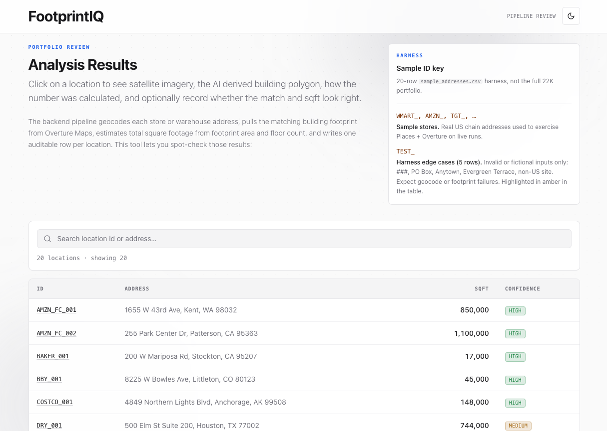
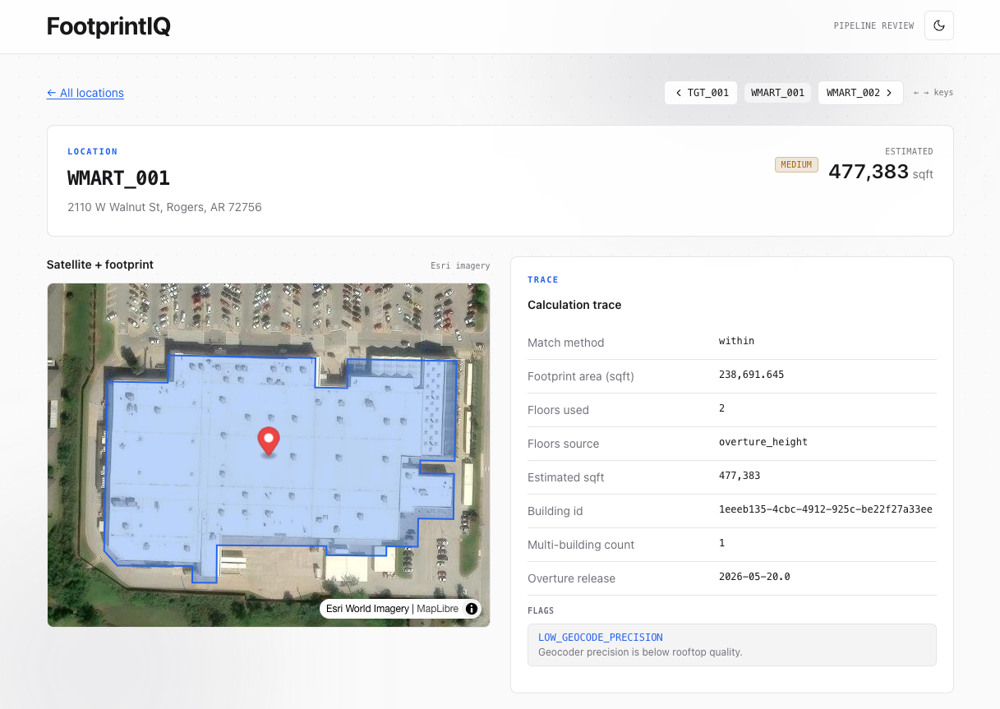

# FootprintIQ

**FootprintIQ** (repo: `roof-survey`) estimates building square footage for large portfolios of US commercial addresses (~22K retail and warehouse sites). It geocodes each location, pulls building footprints from [Overture Maps](https://overturemaps.org/) on AWS S3, matches points to polygons, resolves floor counts, and writes auditable parquet outputs plus a **Next.js + MapLibre QA visualizer** for human review.

All pipeline logic runs in **Python** (`backend/`). The visualizer reads the same parquet files via **DuckDB** in Route Handlers — no separate API service.

## Key Features

- **Portfolio-scale batch:** Handles 1 or 22,000+ addresses in one run. Built for retail/warehouse/industrial portfolios.
- **End-to-end**: From raw address input to geocoding, footprint lookup, polygon matching, floor counts, and audit-parquet output in a single command.
- **Auditable outputs**: Every estimate reports method, confidence, evidence links, and traceable match details for downstream review.
- **Human QA visualizer**: Next.js + MapLibre app for inspecting, searching, and QA/QC'ing locations; verdicts written back to the pipeline.
- **Resumable stages**: All intermediate dataframes are written as parquet files at each step — easy to resume/inspect.
- **Built for transparency**: Outputs are ground-truthable, reproducible, and come with rich summary reports per run.

<!-- markdownlint-disable MD033 -->
<table>
  <tr>
    <td width="50%"></td>
    <td width="50%"></td>
  </tr>
</table>
<!-- markdownlint-enable MD033 -->

## What you get

| Output | Location | Purpose |
|--------|----------|---------|
| `estimates.parquet` | `data/output/` | One row per input location: sqft estimate, match method, flags, confidence |
| `run_<id>/manifest.json` | `data/output/` | Reproducibility: git SHA, config hash, Overture release, stage timings |
| `report.html` | `data/output/` | Summary report (`make report`) |
| `qa_worksheet.csv` | `data/output/` | Stratified rows for manual ground-truth fill-in |
| Interim parquets | `data/interim/` | `normalized`, `geocoded`, `footprints` (resume-friendly) |
| `qa_reviews.parquet` | `data/output/` | Human QA verdicts from the visualizer |

---

## Prerequisites

- **Docker** (optional; postgres profile from Code Red base — pipeline does not require it)
- **[uv](https://docs.astral.sh/uv/)** ≥ 0.7.11 — Python deps and CLI
- **[Bun](https://bun.sh/)** ≥ 1.3.11 — frontend
- **Google Cloud project** with billing enabled (live runs only):
  - [Geocoding API](https://console.cloud.google.com/apis/library/geocoding-backend.googleapis.com)
  - [Places API](https://console.cloud.google.com/apis/library/places-backend.googleapis.com)
- Network access to `stac.overturemaps.org` and `overturemaps-us-west-2` S3 (footprints)

---

## First-time setup

```bash
make check      # tools + create/validate .env from .env.example
make install    # uv sync (backend) + bun install (frontend)
```

Copy API keys into the **repo-root** `.env` only (never `backend/.env` or `frontend/.env`):

```bash
GOOGLE_GEOCODING_API_KEY="..."   # non-chain / generic addresses
GOOGLE_PLACES_API_KEY="..."      # chain retail & warehouses (can be same key if both APIs enabled)
SQFT_DATA_DIR="./data"           # pipeline + visualizer read/write here
```

**Common mistake:** swapping the Geocoding and Places keys — Geocoding returns `REQUEST_DENIED` on non-chain rows if the wrong key is in `GOOGLE_GEOCODING_API_KEY`.

---

## Running the pipeline

All commands use **`make`** (see `make help`). They source `.env` via `scripts/loadenv.bash`.

### 1. Offline demo (no API keys)

Uses committed fixture parquets — good for UI and unit tests, **not** for validating real-world accuracy.

```bash
make demo
make viz
```

### 2. Live sample (20-row harness)

Exercises Google APIs + Overture S3 on `tests/fixtures/sample_addresses.csv`.

```bash
make sample    # runs stac-cache first, then full pipeline with --no-resume
make report
make viz       # http://localhost:3000
```

**Sample location IDs:**

| Prefix | Meaning |
|--------|---------|
| `WMART_`, `AMZN_`, `TGT_`, … | Real US chain addresses for live testing |
| `TEST_` | Intentional fiction/invalid rows (Anytown, PO Box, etc.) — expect failures |

After changing keys or input CSV, clear the geocode cache and re-run:

```bash
rm -f data/interim/geocode_cache.sqlite data/output/estimates.parquet
make sample
```

### 3. Full portfolio run

Place your production CSV at `data/input/all.csv` (gitignored — contains PII). Expected columns: `location_id`, `address_line_1`, `city`, `state`, `postal_code`, `location_type`.

```bash
make full      # prompts via --max-cost-usd; default cap in config.yaml
```

First Overture run builds a STAC file index under `data/interim/overture_stac_buildings_<release>.json` (~4 minutes once; cached afterward).

---

## QA visualizer

```bash
make viz
```

- **List view** — filter/search estimates, `TEST_*` rows highlighted
- **Detail view** — Esri satellite basemap, chosen + candidate footprints, calc trace, QA form
- Writes reviews to `data/output/qa_reviews.parquet`

The app resolves data in this order: `data/output/` → `data/interim/` → `tests/fixtures/` (fixtures show `fixture-1.0` in the calc trace — that means you are not viewing a live run).

Set `SQFT_LOG_LEVEL=DEBUG` in `.env` to see DuckDB paths and API activity in the terminal.

---

## Configuration

| File | Role |
|------|------|
| `.env` | Secrets and overrides (source of truth for keys; gitignored) |
| `.env.example` | Template — committed |
| `config.yaml` | Geocoder chains, spatial rules, floors, Overture release, `data_dir` |

Environment variables use the `SQFT_` prefix (see `.env.example`). Paths in `config.yaml` resolve to the **repo root**, not `backend/`.

---

## Testing

```bash
make test-smoke     # contracts + fixture layout
make test-lane-a    # normalize, geocode, places
make test-lane-b    # spatial, overture, floors, flags
make test-lane-c    # pipeline, manifest, validate
make test-lane-d    # frontend Vitest
make fixtures       # rebuild tests/fixtures/*.parquet
```

---

## Repository layout

```
roof-survey/
├── Makefile, Common.make    # only supported entrypoint (make check, run, test, …)
├── config.yaml              # pipeline defaults
├── .env.example             # env template (copy → .env)
├── backend/src/sqft/        # Python pipeline package
├── frontend/                # Next.js visualizer (Bun)
├── data/                    # gitignored runtime data (input / interim / output)
├── tests/fixtures/          # sample CSV + synthetic parquets for tests/demo
├── ARCHITECTURE.md          # technical deep-dive
├── LANES.md                 # parallel development contracts (Wave 1)
└── AGENTS.md                # agent/tooling conventions (Code Red base)
```

---

## Further reading

- **[ARCHITECTURE.md](./ARCHITECTURE.md)** — pipeline stages, data contracts, Overture/STAC, spatial join, frontend data path
- **[LANES.md](./LANES.md)** — module ownership for contributors
- **`make help`** — all user-facing targets

## License

MIT
