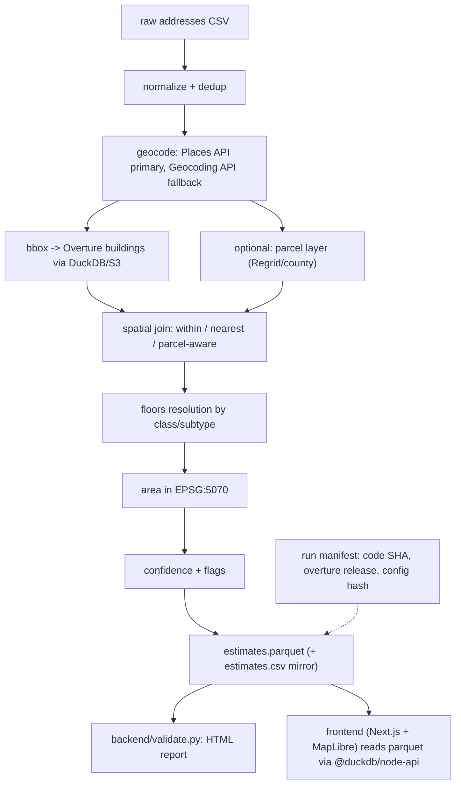

# Building Sqft Estimator — Revised Plan (supersedes ROOF_PROJECT_PLAN.md)

## TL;DR pressure-test findings

The original plan is directionally sound (Overture + DuckDB-over-S3 + EPSG:5070 + SQLite-cached geocoding + multi-building rules + confidence scoring). Real risks live in the **first** and **last** miles: address quality going in, building selection at the parcel, and human verification at the end. Below is what to keep, what to change, what to add, and a concrete visualizer design.

## What the original gets right (keep)

- DuckDB + `httpfs` + `spatial` against Overture S3 with bbox push-down — correct approach.
- **EPSG:5070** for area — non-negotiable, plan calls it out.
- SQLite geocode cache and resume-by-artifact-existence.
- Three multi-building rules configurable, not hardcoded.
- Floor sanity cap at 50, vintage flag, multi-building flag.
- Validation harness with held-out ground truth.

## Where it's weak or wrong (change)

1. **"Geocode then spatial-join" is the wrong primary path for chains.** For Walmart/Target/Amazon/etc., Google **Places API** (Text Search / Place Details) returns the actual POI centroid — usually inside the building — far more reliably than the generic Geocoding API resolving a street address that often lands in a parking lot. Plan should make Places primary for chain retail and big warehouses; Geocoding API is the fallback for one-off addresses.
2. **Census fallback is misleading.** Census/TIGER is range-interpolated only; it will never be ROOFTOP. Using it as the "free fallback" for warehouses will systematically drop points in parking lots and yards. Treat it as low-confidence enrichment, not a real fallback.
3. **No address normalization stage.** Real chain-CRM exports are messy ("Walmart #4521", "Bldg C, Dock 14", "Suite 200"). Without normalization + dedup, you'll waste $30–$50 of API quota geocoding duplicates and mangled strings. Add **libpostal/`usaddress`** + USPS Address Validation (or Google Address Validation) as Stage 0.
4. **Parcel boundary is faked with a `parcel_buffer_meters: 75`.** A DC parcel is 500m wide, a row-house parcel is 5m. This guess will silently pick the wrong building for both. Add an optional **Regrid/county parcel** layer; without it, switch to **k-nearest + class/subtype filtering** instead of a fixed buffer.
5. **Default `floors = 1` is wrong for retail, fine for warehouse.** Need defaults by Overture `class`/`subtype`. Also height-to-floors at 4m/floor will say a 12m warehouse is 3 floors — it's 1. Need a "tall single-story" rule for industrial subtypes.
6. **Footprint sanity range (1K–500K sqft) excludes legit DCs.** Amazon BFI4 is ~3.6M sqft single building. Make bounds class-aware.
7. **`flags` as a comma-separated string is annoying downstream.** Use boolean columns *and* a JSON array.
8. **Cost guardrail $50 threshold is too low and not stratified.** 22K × $5/1K = $110 baseline. After dedup it's probably $70–$90. Print a 3-line cost preview: addresses → unique after normalize → unique after cache hit → estimated $.
9. **No reproducibility metadata.** Output must record: Overture release pinned for that run, pipeline_run_id, config hash, geocoder provider, code git SHA. The "latest" resolution in `overture.py` is fine but must be **captured into the artifact**, not just used and forgotten.
10. **Validation sample of 50 is too small for a 22K corpus** and the plan never says how it's drawn. Switch to **stratified sampling** across `(location_type × confidence × footprint-size decile)`, aim for 150–250 manually-validated rows.
11. **No address-level PII discipline.** Real addresses ARE PII. Gitignore `data/`, never ship addresses to telemetry, scrub from log lines.
12. **No CI / lint / typing hygiene** — ruff + mypy + pre-commit + a single `make check` are 30 minutes of setup and save hours later.
13. **No "human visualizer."** The user explicitly wants one. The plan only mentions "manually verify in Google Maps" — that doesn't scale even to 50 rows. Build a Next.js + MapLibre app from day one (see below).
14. **Off-pattern project shape.** The team standard is **Code Red Base** (Makefile entrypoint, Python+uv backend, Next.js+Bun frontend, docker-compose for infra, `.env`/`.env.example` discipline). The original plan invents an ad-hoc layout. Bootstrap from `$CODE_RED_BASE/scripts/install.bash` instead.

## What's missing entirely (add)

- **Address normalization + dedup stage** (Stage 0).
- **Overture `places` theme** as a candidate snap target — for branded retail this often beats geocoding.
- **Parcel layer (optional)** — Regrid free tier or county GIS where available.
- **Run manifest** — JSON sidecar capturing inputs/config/code/data versions.
- **Stratified ground-truth sampler** — generates the 150–250 row QA worksheet.
- **Next.js + MapLibre visualizer** (`frontend/`) — per-address satellite + footprint overlay + calc trace + ground-truth entry, reading pipeline parquet directly via `@duckdb/node-api` in Route Handlers.
- **ML-on-tile fallback** (stretch) for unmatched rows — Segment Anything on a Google Static Maps tile, click-to-segment, area in EPSG:5070. Keeps coverage close to 100%.
- **Pipeline observability**: per-stage row counts, drop reasons, timings — written to `data/output/run_<id>/metrics.json`.

---

## Revised architecture



Stages are **content-addressable**: each writes `data/interim/<stage>__<input_hash>.parquet`, so re-runs are bulletproof. The same `data/` directory is mounted into the frontend container so Route Handlers can DuckDB-query the latest parquet directly — no API service in between.

## Revised repo layout (Code Red shape)

```
roof-survey/
├── Makefile                  # includes Common.make; adds project targets
├── Common.make               # from $CODE_RED_BASE
├── .env.example              # source of truth
├── docker-compose.yml        # infra-only (no app logic)
├── scripts/
│   ├── checkenv.bash
│   └── log.bash
├── data/                     # gitignored; shared volume
│   ├── input/                # raw CSVs (PII — never committed)
│   ├── interim/              # geocoded.parquet, footprints.parquet, candidates.parquet
│   └── output/               # estimates.parquet, estimates.csv, report.html, run_<id>/
├── backend/                  # Python + uv
│   ├── pyproject.toml
│   ├── .env.example
│   ├── src/sqft/
│   │   ├── normalize.py      # usaddress + USPS/Google Address Validation
│   │   ├── dedup.py
│   │   ├── geocode.py        # Places primary, Geocoding fallback, SQLite cache
│   │   ├── places.py
│   │   ├── overture.py       # DuckDB+httpfs+spatial S3 query
│   │   ├── parcels.py        # optional Regrid/county loader
│   │   ├── spatial_join.py   # parcel-aware when available; k-NN otherwise
│   │   ├── area.py           # EPSG:5070
│   │   ├── floors.py         # class/subtype-aware defaults
│   │   ├── flags.py
│   │   ├── manifest.py
│   │   ├── pipeline.py
│   │   ├── validate.py
│   │   ├── cli.py            # typer
│   │   └── io.py
│   └── tests/
└── frontend/                 # Next.js (App Router) + Bun + Tailwind + shadcn
    ├── package.json
    ├── .env.example
    ├── app/
    │   ├── page.tsx                          # list view (filterable table)
    │   ├── locations/[id]/page.tsx           # detail view (map + calc trace + QA form)
    │   └── api/
    │       ├── locations/route.ts            # GET list with filters
    │       ├── locations/[id]/route.ts       # GET single + candidates + geocode + footprint geojson
    │       ├── qa/route.ts                   # POST QA review -> appends to qa_reviews.parquet
    │       └── runs/route.ts                 # GET run manifests
    ├── lib/
    │   ├── duckdb.ts                         # singleton @duckdb/node-api connection
    │   ├── queries.ts                        # parameterized SQL against data/output/*.parquet
    │   └── schema.ts                         # zod types shared by API + UI
    ├── components/
    │   ├── map/                              # MapLibre wrapper, layers
    │   ├── calc-trace.tsx
    │   ├── qa-form.tsx
    │   ├── flag-chips.tsx
    │   └── filter-bar.tsx
    └── tests/
```

## Visualizer design (Next.js + MapLibre)

Goal: a case-team analyst opens `http://localhost:3000`, filters/searches the 22K rows, clicks one, sees a satellite map with the chosen footprint highlighted, all candidate footprints faded around it, the full calc trace, and can submit a QA verdict + optional ground-truth sqft in one click.

### Routes

- `/` — **List view**: virtualized table (TanStack Table) over all rows, columns: `location_id`, `address`, `state`, `confidence`, `estimated_sqft`, `flags`. Filters: confidence pill (high/med/low/unmatched), location_type, state, flag toggles, free-text search. Clicking a row → detail view.
- `/locations/[id]` — **Detail view**:
  - **Map** (left, ~65% width, `react-map-gl/maplibre`):
    - Basemap: Esri World Imagery raster XYZ (free, no key). Toggle for Mapbox Satellite if `NEXT_PUBLIC_MAPBOX_TOKEN` set.
    - Layers:
      - Geocoded point — circle marker, color by precision (green=ROOFTOP, yellow=RANGE_INTERPOLATED, red=worse).
      - Chosen building polygon — bold outline, area label centered.
      - Candidate polygons within parcel buffer — faded fill, click to inspect.
      - `search_buffer_meters` circle (dashed).
      - Optional parcel outline (if parcel layer available).
    - Interactions: click any polygon → "what if this were the chosen one?" preview in calc panel; hover → tooltip with area + class/subtype.
  - **Calc trace** (right, ~35% width, shadcn `Card`):
    - Raw input → normalized address → geocoder result (provider, precision, formatted_address, lat/lon).
    - Overture match: `building_id`, source (OSM/Microsoft/Google), `update_time`, `class`, `subtype`, raw `height` / `num_floors` if present.
    - Floors: value used + source badge (`num_floors` / `height` / `subtype default` / `default`).
    - Explicit calc line: `35,420 sqft (footprint) × 1 floor = 35,420 sqft`.
    - Flags as colored `Badge` chips with tooltip explanations.
    - Run manifest link (which pipeline run produced this row).
  - **QA form** (bottom of right panel):
    - "Building selection: correct / wrong / ambiguous" radio.
    - "Estimated sqft looks: low / right / high" radio.
    - Optional `actual_sqft` number input.
    - Free-text notes.
    - Submit → POST `/api/qa` → appends to `data/output/qa_reviews.parquet`. This **is** the growing ground-truth dataset.
  - Keyboard: `←`/`→` to navigate to prev/next row in current filter (massive QA speedup).

### Data plumbing

- `lib/duckdb.ts` initializes a singleton `@duckdb/node-api` instance pointed at `data/output/estimates.parquet` and `data/interim/footprints.parquet` (mounted via docker-compose). Spatial extension auto-installed on first query.
- All Route Handlers are server-side; no parquet ever shipped to the browser. The browser only sees JSON of the rows it needs.
- `/api/locations/[id]` returns shape:
  ```json
  {
    "row": {...},
    "geocode": {"lat":..., "lon":..., "precision":..., "provider":...},
    "chosen_building": {"id":..., "geometry":<GeoJSON>, "area_sqft":..., "class":..., "subtype":...},
    "candidates": [{"id":..., "geometry":..., "area_sqft":..., "distance_m":...}],
    "parcel": null | <GeoJSON>,
    "flags": [{"key":"OLD_FOOTPRINT","explanation":"..."}],
    "manifest_url": "/api/runs/<id>"
  }
  ```
- Cache strategy: Next.js `unstable_cache` keyed on `(estimates.parquet mtime, location_id)`; invalidated when a new pipeline run lands.

### Why this over Streamlit

- Real map UX (MapLibre vector + raster, click-on-polygon, smooth zoom) for hundreds of QA reviews.
- shadcn + Tailwind gives polish without design work.
- No second long-lived service: DuckDB-in-Node reads the same parquet the pipeline writes.
- Code Red shape: `make run-detached && make ping` works out of the box.

### Run it

```bash
make check
make run-detached
make ping
open http://localhost:3000
```

## Module-level changes (delta from original plan)

### `normalize.py` (new)
- Parse with `usaddress` (pure-python; `libpostal` if installable).
- Strip store-number suffixes (`#4521`), dock/suite designators where they prevent matching.
- Optional USPS Address Validation pass (free tier: ~10K/day) OR Google Address Validation ($17/1K — cheaper than re-geocoding bad rows).
- Emit `address_key` = `(normalized_line1, city, state2, zip5)` for dedup.

### `geocode.py` (changed)
- **Provider order:** Places API Text Search (with `address` field type) → Place Details for precision → Geocoding API fallback.
- Cache key: `address_key` not raw string (so dedup'd addresses share a single API call).
- Persist full provider response in cache (so we can mine `place_id`, opening hours, business type, etc. later without re-calling).
- Hard cost stop: `--max-cost-usd 150` flag, must be passed for >$50 estimated spend.

### `spatial_join.py` (changed)
- If parcel layer present: snap point to parcel → enumerate buildings within parcel → apply `multi_building_rule` *within parcel*. Stops the "picked the shed across the property line" failure.
- If no parcel: k=5 nearest within `search_buffer_meters`, then filter by `class in {commercial, industrial, retail}` if known, else largest.
- Record **all** candidate building IDs + areas in a `candidates` JSON column (visualizer reads this).

### `floors.py` (changed)
```python
DEFAULT_FLOORS_BY_SUBTYPE = {
    "warehouse": 1, "industrial": 1, "logistics": 1,
    "retail": 1, "supermarket": 1, "shopping_centre": 1,
    "office": 3, "commercial": 2,
}
```
- If `subtype in {warehouse, industrial}`: **ignore `height`** for floor estimation; cap at 1.
- Else height→floors with 4m/floor, but only if `height < 80m` (above that, almost certainly a parsing artifact).

### `flags.py` (new)
- Centralizes all rule evaluations. Each flag is a function `(row) -> bool`. Produces boolean columns AND a `flags_json` array for downstream tools. No more comma-strings.

### `manifest.py` (new)
- Writes `data/output/run_<id>/manifest.json` with: input file SHA-256, config SHA-256, code git SHA, Overture release string actually used, geocoder provider mix, row counts in/out per stage, wall time, total API spend.

### `validate.py` (changed)
- Stratified sampler: outputs `data/output/qa_worksheet.csv` of N rows (default 200) balanced across `(location_type, confidence, footprint_decile)`.
- HTML report adds: per-state coverage map, candidate-count distribution, "% of rows where chosen building was not the largest within buffer" (a watchdog metric).

### Output schema additions
- `address_key`, `overture_class`, `overture_subtype`, `overture_source`, `overture_release`, `candidates_json`, `pipeline_run_id`, plus boolean columns for each flag in addition to `flags_json`.

## Cost re-estimate (more honest)

- 22K rows → ~16–18K unique addresses after normalize/dedup (chains have duplicates).
- Google Places Text Search: $32/1K → ~$550 if used for **everything**. **Don't**: use Places only when input looks like a chain (token like "Walmart", "Target", "Amazon", etc.) — call it ~30% of unique rows ≈ ~$170.
- Google Geocoding API: $5/1K for the remaining 70% (~12K) ≈ ~$60.
- Optional Google Address Validation: $17/1K for the ~10% that fail or look broken ≈ ~$30.
- **Total realistic: $200–$300.** Above the original $200 ceiling — flag this to the case team. If hard cap is $200: skip Places, accept lower precision on chains, and lean on the visualizer for QA.

## Code Red Make targets (project-specific additions to Common.make)

```makefile
.PHONY: geocode ## Run normalize + dedup + geocode stage
.PHONY: footprints ## Pull Overture footprints for geocoded bbox
.PHONY: join ## Spatial join + area + floors + flags
.PHONY: estimate ## Full pipeline (resume-aware) on data/input/*.csv
.PHONY: report ## Generate validate.py HTML report
.PHONY: viz ## Start frontend dev server (alias: make run-detached)
.PHONY: sample ## Run on data/input/sample_500.csv
.PHONY: full ## Run on full 22K with --max-cost-usd 250 (requires confirmation)
```

All wrap `uv run` inside `backend/` or `bun run` inside `frontend/`; no raw `python`/`bun` in user-facing docs.

## Definition of done (revised)

- [ ] `make sample` runs end-to-end green on 500 rows.
- [ ] Run manifest JSON written with all reproducibility fields.
- [ ] `make run-detached && make ping` brings up the frontend; any `location_id` renders in <1s.
- [ ] Re-runs hit the geocoder cache (zero billable API calls on identical input).
- [ ] `make check` (env + ruff + mypy + pytest + frontend `bun test`/`tsc --noEmit`) green in CI.
- [ ] Stratified ground-truth worksheet of 200 rows generated; QA form writes to `qa_reviews.parquet`.
- [ ] On returned ground truth, MAPE reported with 95% bootstrap CI, broken out by `(location_type, confidence)`.
- [ ] README: "5-step run-it" section + screenshot of the visualizer.

## Stretch (worth calling out explicitly)

- **SAM-on-tile fallback** for `unmatched` rows: Google Static Maps tile → Segment Anything via `segment-anything` pip package → polygon → area. Lifts coverage from ~92% to ~98%. ~$2 in tile fetches for the residual.
- **Confidence-weighted portfolio total** with bootstrap CI.
- **Databricks delta sink** if their environment is set up.
- **Per-state diff vs. county assessor totals** as an external sanity check.

## Suggested execution order (4–6 days)

1. **Day 1 AM** — Bootstrap with `$CODE_RED_BASE/scripts/install.bash .`, then `make check`. Create `backend/` (uv init) + `frontend/` (`bun create next-app`, add Tailwind + shadcn + `maplibre-gl` + `react-map-gl` + `@duckdb/node-api` + `@tanstack/react-table` + `@tanstack/react-query`). Wire docker-compose to mount shared `data/`.
2. **Day 1 PM** — `backend/src/sqft/`: `manifest.py`, `io.py`, `area.py` (with hand-verified polygon unit test), `normalize.py` + `dedup.py` + tests.
3. **Day 2 AM** — `geocode.py` + `places.py` + SQLite cache + tests against 20 fixtures. Verify cache prevents re-calls.
4. **Day 2 PM** — `overture.py` against bbox of fixtures (~few hundred buildings, not millions). `spatial_join.py` + `floors.py` + `flags.py` end-to-end on fixtures.
5. **Day 3** — `pipeline.py` + `cli.py` + `validate.py`. Run `make sample` on a fixture CSV; produce first `estimates.parquet`.
6. **Day 4** — Frontend: `lib/duckdb.ts`, Route Handlers (`/api/locations`, `/api/locations/[id]`, `/api/qa`), list view + detail view + MapLibre layers. Use the 500-row fixture output to develop against real data.
7. **Day 5 AM** — Dry-run `make sample` on 500 of the real 22K; iterate using the visualizer (this is when most multi-building rule bugs surface).
8. **Day 5 PM** — Stratified ground-truth worksheet → hand-fill 200 rows → MAPE with bootstrap CI → tune `multi_building_rule`, floor defaults, confidence thresholds.
9. **Day 6** — `make full` with `--max-cost-usd 250`. Generate final report; hand off visualizer URL to case team.
